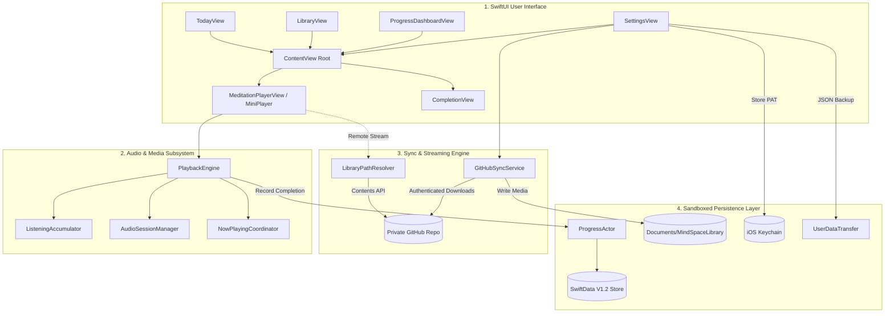

# 🧘 MindSpace iOS

> **An intentional, private, offline-first native iOS meditation app.**  
> Free from algorithmic feeds, subscription paywalls, third-party analytics, and commercial data harvesting. Built with native SwiftUI, local SwiftData storage, private GitHub companion synchronization, and zero-compromise privacy — **100% free and open forever**.

---

[](LICENSE)
[-blue.svg)](https://github.com/vkr1729/MindSpace-iOS/releases)
[](https://developer.apple.com/ios/)
[](https://swift.org)
[](#-zero-telemetry-invariant)
[](#3-hardened-swiftdata-persistence--migration-engine)
[](#-installation--sideloading)

---

## 💡 Why MindSpace?

Mainstream meditation apps have succumbed to the incentives of commercial attention extraction:
* **Predatory Subscriptions:** Basic timer and guided meditation libraries locked behind steep monthly paywalls ($70–$100/yr).
* **Privacy Erosion:** Embedded tracking SDKs (Meta Pixel, Google Analytics, Adjust, Branch, Segment) harvesting behavioral patterns, session frequency, and emotional reflections.
* **Notification Fatigue & Gamification:** Loud, anxious gamification streaks and badges designed to manipulate habit loops rather than cultivate stillness.
* **Tethered Cloud Dependency:** Unusable on airplanes, retreats, remote nature sites, or during network disruptions.

### MindSpace inverts this model:

1. **Private by Design:** Zero analytics, zero third-party telemetry, zero ad trackers. The app operates completely isolated on your device.
2. **Quiet Native Experience:** Adheres to Apple’s Human Interface Guidelines. Clean typography, full Dynamic Type support, high-contrast Zen mode, and calming organic palettes (`MindSpaceTheme`).
3. **True Offline Freedom:** Your media library lives directly inside your device's protected sandboxed storage. Complete practices anywhere without an internet connection.
4. **Self-Hosted Companion Sync:** Optionally stream or download additional audio/video packs from your own private GitHub repository using a secure Keychain-stored Personal Access Token (PAT).
5. **Data Sovereignty:** Your progress, streaks, and reflections reside in a versioned SwiftData store that you can export, back up, or inspect at any time.

---

## ✨ Key Architectural Pillars

### 1. Quiet Native Design System
* **Dynamic Type & Accessibility:** Fully adaptive font scaling using semantic typography (`.headline`, `.subheadline`, `.body`) and minimum 44×44 pt touch targets across all interactive elements.
* **MindSpaceTheme Semantic Palette:** Calm, cohesive color tokens for backgrounds, cards, typography, dividers, and category accents (`Foundation`, `Focus`, `Unwind`, `Sleep Sounds`, `SOS`).
* **Distraction-Free Zen Mode:** Fullscreen meditation player with tap-to-dim controls, subtle progress pacing, and zero decorative visual noise.
* **Intuitive Navigation:** Streamlined 4-tab native navigation:
  * **Today:** Daily recommended journey, active streak indicator, and quick-resume playback cards.
  * **Library:** Categorized courses, standalone singles, search filtering, and offline download status indicators.
  * **Progress:** Practice streak metrics, interactive monthly completion heatmaps, and milestone history.
  * **Settings:** Private GitHub sync credentials, storage quota management, backup export/import, and notification scheduling.

### 2. Robust Audio & Video Playback Engine
* **Hybrid Media Support:** Plays local audio tracks, attached instructional day-videos, and authenticated on-demand remote streams seamlessly.
* **Anti-Scrub Listening Accumulator:** Tracks genuine listening seconds via `ListeningAccumulator`. Scrubbing or skipping does not trigger false practice completions.
* **AVFoundation & Lock Screen Remote Control:**
  * Full `MPNowPlayingInfoCenter` and `MPRemoteCommandCenter` integration with playback state, scrub controls, and artwork.
  * Background audio mode (`UIBackgroundModes: audio`) ensures uninterrupted practice with the screen locked or app suspended.
* **Interruption & Disconnect Handling:** Gracefully handles incoming phone calls, Siri interruptions, and headphone disconnects (`AVAudioSession.interruptionNotification`, `routeSharingPolicy`).
* **Sleep Timer:** Integrated 15m, 30m, 45m, and 60m countdown timers with gentle automatic pause.

### 3. Hardened SwiftData Persistence & Migration Engine
* **Versioned Schema Architecture:** Built with `VersionedSchema` (`MindSpaceSchemaV1_2`) and automated `SchemaMigrationPlan` (`MindSpaceMigrationPlan`) ensuring forward data compatibility across updates without data loss.
* **PendingCompletion Write-Ahead Outbox:** Network or storage errors enqueue failed completions into a persistent `PendingCompletion` outbox, automatically replayed and flushed on launch, foregrounding, or backgrounding.
* **Corrupt Store Quarantine & Salvage:** If the SQLite store suffers non-migration corruption, the app safely moves the damaged database aside (`default.store.corrupt_<timestamp>`) and initializes a clean store rather than wiping user data.
* **Atomic Settings Initialization:** `SettingsStore.fetchOrCreate` prevents unique-constraint races during concurrent tab initialization.

### 4. Private GitHub Content Synchronization
* **Self-Hosted Library:** Pull meditation courses directly from a private personal GitHub repository (e.g. `your-username/MindSpace-Content`).
* **Hardware Keychain Protection:** PAT credentials are encrypted in the iOS Keychain via `KeychainManager` (`kSecAttrAccessibleAfterFirstUnlockThisDeviceOnly`).
* **Contents-API Streaming:** Uses the GitHub Contents API (`api.github.com/repos/.../contents/...`) with `Accept: application/vnd.github.raw` headers. This prevents token stripping across redirects (which occurs with `raw.githubusercontent.com`).
* **Background Download Queue:** Foreground downloads are protected with `UIApplication.beginBackgroundTask`, allowing media sync queues to complete cleanly even when pressing the home button.
* **Exponential Backoff:** Automated 3-stage retry logic handles transient network failures gracefully without stalling the UI.

### 5. 🔒 Zero-Telemetry Invariant
MindSpace strictly forbids all third-party tracking:
* **No Telemetry SDKs:** No Google Analytics, Firebase, Sentry, Segment, Adjust, AppsFlyer, or Facebook SDK.
* **No Covert Network Calls:** Networking is confined strictly to authenticated sync requests directed to `api.github.com` and `raw.githubusercontent.com`.
* **Automated CI Enforcement:** Static verification script (`scripts/verify_codebase.py`) scans all source files on every commit to enforce the Zero-Network rule.

---

## 🏗️ System Architecture



---

## 📂 Repository Structure

```
MindSpace-iOS/
├── Sources/MindSpace/               # Core Application Target
│   ├── AudioEngine/                 # AVFoundation playback, audio session & now-playing
│   ├── DesignSystem/                # MindSpaceTheme, colors, spacing, semantic styles
│   ├── Models/                      # Catalog models, SwiftData models & VersionedSchema
│   ├── Services/                    # Sync, Catalog, Keychain, SettingsStore, ProgressActor
│   ├── Support/                     # Headless simulator UITestSupport fixtures
│   ├── Views/                       # SwiftUI views (Today, Library, Player, Progress, Settings)
│   ├── MindSpaceApp.swift           # App entry point, ModelContainer & lifecycle
│   └── Info.plist                   # App configuration & permissions
├── Tests/                           # Test Targets
│   ├── MindSpaceTests/              # 21 unit test suites (Catalog, P0-P2, Concurrency, etc.)
│   └── MindSpaceUITests/            # Headless iPhone 16 Simulator UI test suite
├── Resources/                       # Bundled assets & base catalog
│   ├── Assets.xcassets/             # Opaque Quiet Native AppIcon
│   ├── catalog.json                 # Core bundle meditation catalog
│   └── catalog.sha256               # Cryptographic catalog integrity verification
├── artifacts/                       # Sideloading automation shortcuts & configs
├── dist/                            # GitHub Pages OTA distribution (apps.json, manifest)
├── scripts/                         # Build, verification & version synchronization tools
│   ├── inspect_release_artifact.py  # Release IPA privacy & structure verification
│   ├── sync_version.py              # Canonical version alignment across targets
│   └── verify_codebase.py           # 7-gate static analysis & Zero-Network enforcement
├── apps.json                        # Canonical versioning source of truth (v3.0.0, Build 12)
└── project.yml                      # XcodeGen project specification
```

---

## 📲 Installation & Sideloading

MindSpace is distributed as an unsigned IPA for private personal sideloading. It does not require a paid Apple Developer account.

### Option 1: LiveContainer (Recommended)
[LiveContainer](https://github.com/khanhduytran0/LiveContainer) allows running unsigned apps without consuming standard 3-app sideloading slots.
1. Download **`MindSpace.ipa`** from the [Latest Release](https://github.com/vkr1729/MindSpace-iOS/releases).
2. Open the **Files** app on your iPhone and move `MindSpace.ipa` into **`On My iPhone/LiveContainer`**.
3. Launch **LiveContainer** and tap **`+`** to install and run MindSpace.
4. *(Optional)* Import `artifacts/LiveContainer Nightly Refresh.shortcut` to automate background 7-day refreshing via LocalDevVPN.

### Option 2: SideStore / AltStore
1. Add the MindSpace SideStore source URL:
   ```
   https://raw.githubusercontent.com/vkr1729/MindSpace-iOS/main/apps.json
   ```
2. Tap **Install** within SideStore/AltStore.

### Option 3: Direct USB / Xcode Installation
With Xcode installed on macOS:
```bash
xcrun devicectl device install app --device <device-id> MindSpace.ipa
```

---

## 🛠️ Development & Build Pipeline

### Prerequisites
* **macOS 14+ / Xcode 16+** (for local compilation and running simulator tests)
* **XcodeGen:** `brew install xcodegen`
* **Python 3.10+**

### Local Setup
1. Clone the repository:
   ```bash
   git clone https://github.com/vkr1729/MindSpace-iOS.git
   cd MindSpace-iOS
   ```
2. Generate the Xcode project:
   ```bash
   xcodegen generate
   ```
3. Run codebase pre-flight checks:
   ```bash
   python3 scripts/verify_codebase.py
   ```
4. Open and build in Xcode:
   ```bash
   open MindSpace.xcodeproj
   ```

### Verification & Automated Testing
MindSpace enforces automated validation gates:
* **Static Analysis:**
  ```bash
  python3 scripts/verify_codebase.py
  ```
  Validates zero-network imports, bracket balancing, Quiet Native asset invariants, and version sync.
* **Unit Tests (21 Suites):**
  ```bash
  xcodebuild test -project MindSpace.xcodeproj -scheme MindSpace -destination "platform=iOS Simulator,name=iPhone 16"
  ```
* **Release Artifact Inspection:**
  ```bash
  python3 scripts/inspect_release_artifact.py MindSpace.ipa
  ```
  Validates IPA structure, entitlements, Info.plist entries, and audits for binary credential leaks.

---

## 📄 License & Privacy Notice

* **License:** Distributed under the [MIT License](LICENSE).
* **Privacy Statement:** MindSpace does not collect, transmit, store, or sell any personal information. All health, practice, and reflection data remains exclusively on your device.
